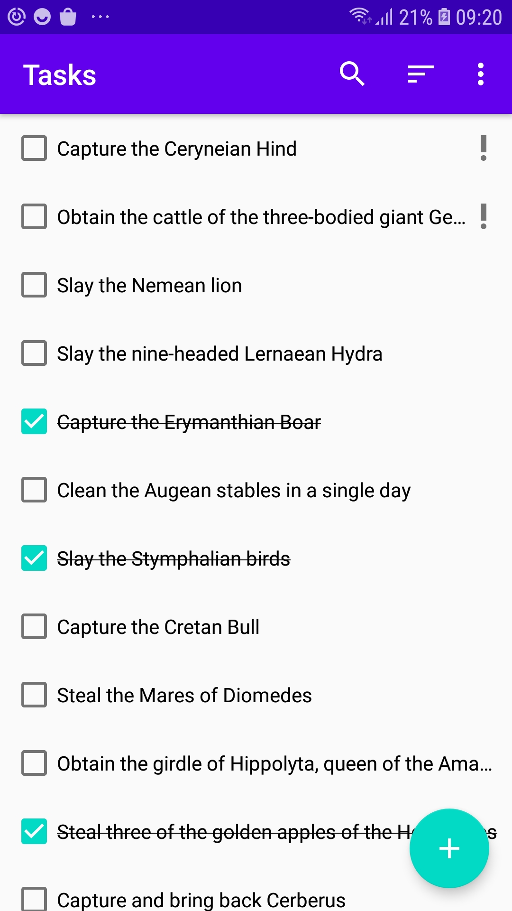
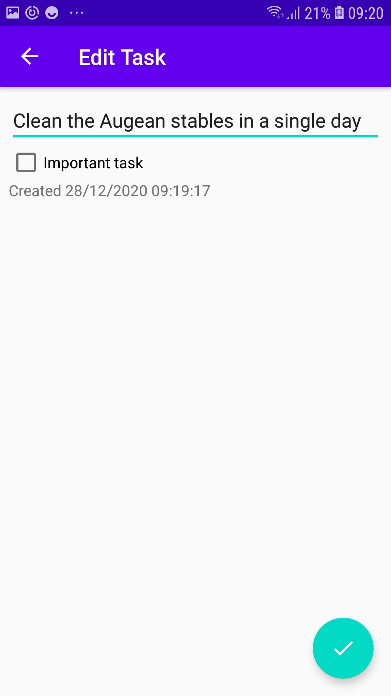
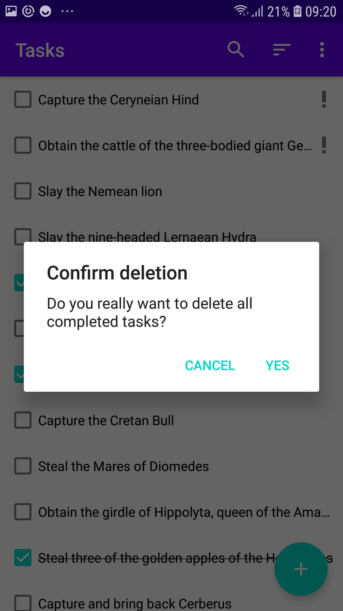
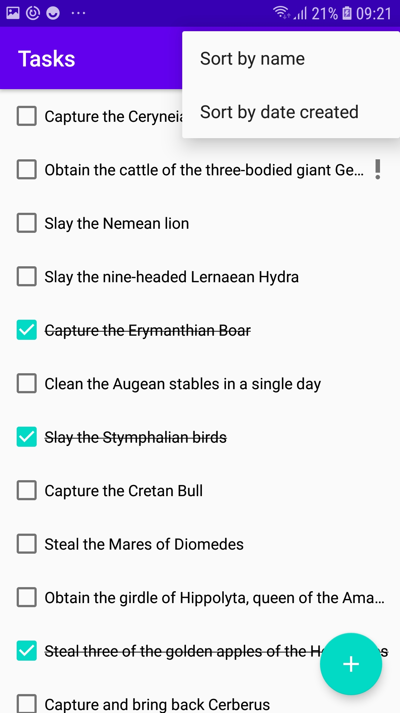
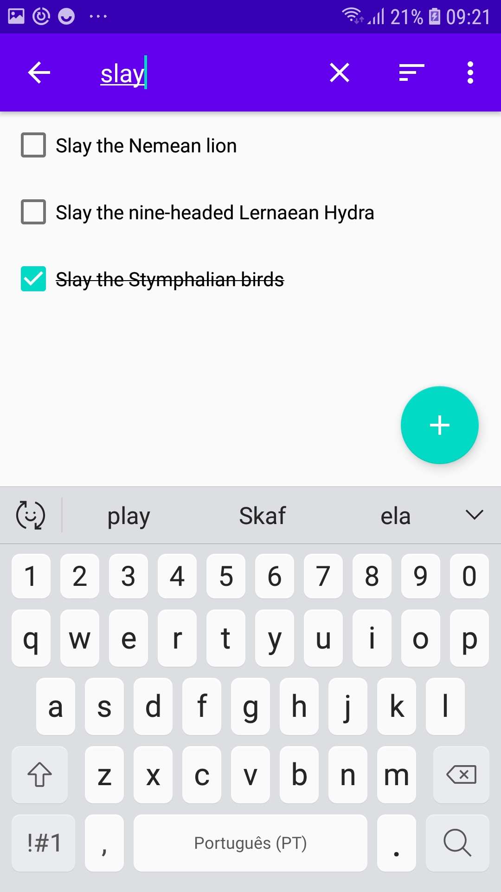

# Hercules-Labours
A to-do list app that stores tasks in an SQLite database and can be searched and filtered by the user

# Architecture & Libraries
    - MVVM
    - Coroutines & Flow
    - Room
    - Jetpack DataStore
    - Dagger Hilt
    
## App preview:

Image #1            |  Image #2           |  Image #3
:-------------------------:|:----------------------------:|:-------------------------:
    |   | 

Image #4            |  Image #5           
:-------------------------:|:----------------------------:
    |   